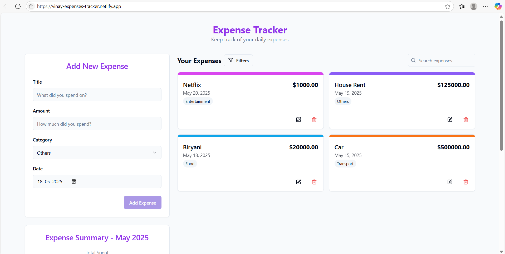
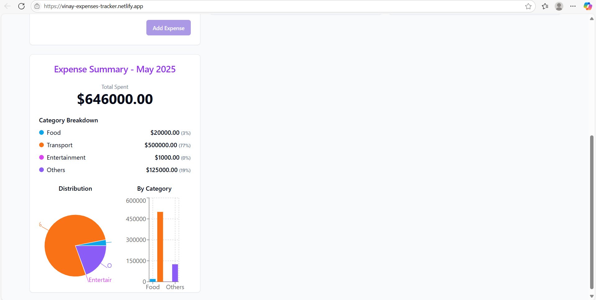

# Vinay's Expense Tracker 💰📊

## 🚀 Live Demo
Check out the live app here: [vinay-expenses-tracker.netlify.app](https://vinay-expenses-tracker.netlify.app/)

---

## ✨ Project Overview
An intuitive and responsive **Expense Tracker** web app designed to help you effortlessly manage your personal finances. Track your daily expenses, categorize them, and gain insights into your spending habits — all wrapped in a sleek, user-friendly interface.

---

## 🔥 Key Features

- **Add & Manage Expenses:** Easily add new expenses with details like amount, category, and date.
- **Edit & Delete:** Update or remove expenses as needed.
- **Real-time Summary:** View your total spending and breakdown by categories.
- **Responsive Design:** Fully optimized for mobile, tablet, and desktop.
- **Modern UI:** Built with React and Tailwind CSS for a clean and dynamic experience.

---

## 🖼️ Screenshots

<p float="left">
  
  
</p>

---

## 🛠️ Tech Stack

| Frontend          | Backend           | Styling           |
| ----------------- | ----------------- | ----------------- |
| React (TypeScript) | — (Static frontend) | Tailwind CSS      |
| Vite              |                   | shadcn-ui         |

---

## 🏗️ Getting Started

Clone the repository and get your local environment up and running in no time:

```bash
git clone <YOUR_GIT_URL>
cd <YOUR_PROJECT_NAME>
npm install
npm run dev

```
## 📦 Deployment
```
This project is deployed on Netlify — every push to the main branch triggers an automatic deployment to:

https://vinay-expenses-tracker.netlify.app/
```
## 👨‍💻 About Me
```
Hi, I’m Vinay Kumar, a passionate web developer who loves building efficient and elegant applications.
Feel free to connect or collaborate!

💼 Portfolio: [https://vinay21-portfolio.netlify.app/]

📫 Email: agathamudivinaykumar@gmail.com

🔗 LinkedIn: [https://www.linkedin.com/in/agathamudi-vinay-kumar-0677a4235/]

```
## 🙌 Contributing
Contributions are welcome! Feel free to open issues or submit pull requests to help improve this project.
